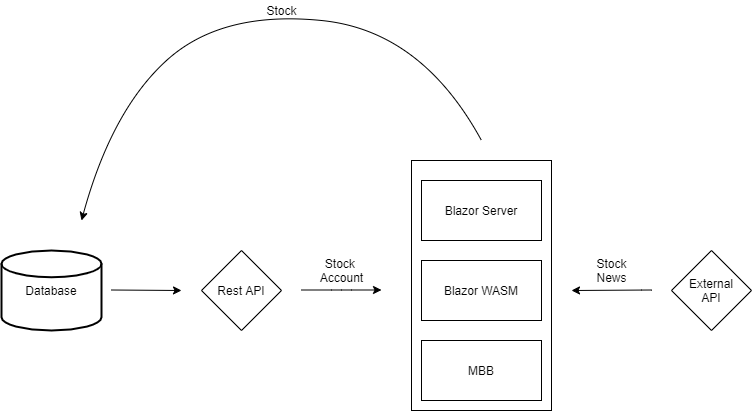

## Inception Phase for Diversify
__________________________________

**Objective**: Create an app for dividend investors so that they could track their stocks, income, and their diversification. 

**Architecture Plan**:
- Since application will be built on three different Blazor hosting model, the architecture will be designed as the following.  

- Database would be a MSSQL Server Database. 
- The RestAPI would be built using the .NET Core Web API
- External APIs/resources currently consist of the following unless found unfit:
    - Necessary stock information
        - Alpha Vantage 
    - Stock News
        - Stock News API
    - Graphs 
        - Syncfusion 
- Authentication will enabled on the RestAPI
- Stock information as well as the user information should be updated in the background using Hangfire

**Considerations / Planning Functionality**:
- Reusing the components with minimal effort between the three hosting models
- Finding the right scheduling time to execute Hangfire
- Design changes of the overall applications 

