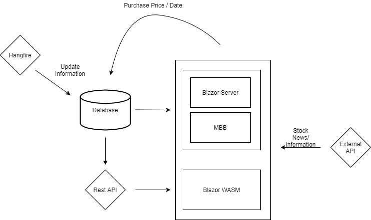

## Inception Phase for Diversify
__________________________________

**Objective**: Create an app for dividend investors so that they could track their stocks, income, and their diversification. 

**Architecture Plan**:
- Since application will be built on three different Blazor hosting model, the architecture will be designed as the following.  

- Database would be a MSSQL Server Database. 
- The RestAPI would be built using the .NET Core Web API
- External APIs/resources currently consist of the following unless found unfit:
    - Necessary stock information
        - Alpha Vantage (First option)
        - Financial Modeling Prep  
        - Yahoo Finance (Hosted on RapidAPI)
    - Stock News
        - Stock News API
    - Graphs 
        - Syncfusion 
- Authentication will enabled on the RestAPI

**Considerations / Planning Functionality**:
- How to call the external API effectively without hitting the hard quota
- For the live deployment, which cloud provider to use
- Will ignore scalability until application fully deployed
- How to secure the RestAPI (third-party?)
- Leveraging each Blazor hosting model features
- Database schema design for stock 
- Authentication: how and where do I do it 

